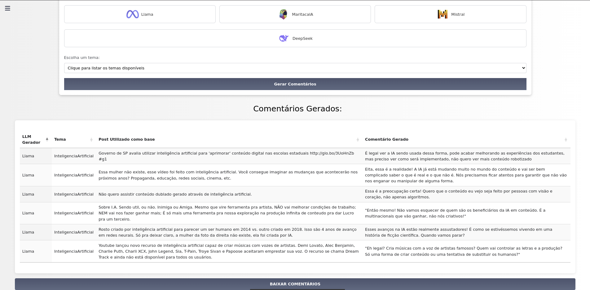
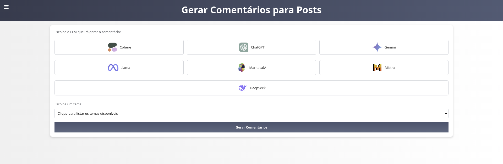
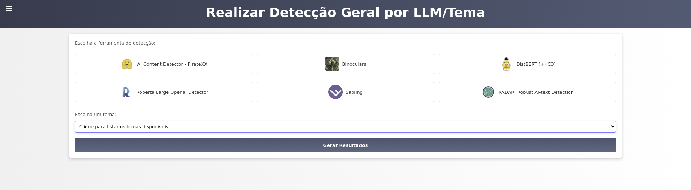

# 📜 Projeto de Geração e Detecção de Texto gerados por LLMs

## 📌 Descrição
Este projeto utiliza Modelos de Linguagem (LLMs) para gerar comentários com base em posts do twitter previamente selecionados e posteriormente
utiliza detectores da literatura para verificar o quão efetivos eles são para detecção destes textos.









## 📂 Estrutura do Projeto
📁 Projeto  
│-- 📄 `app.py`                      # Arquivo principal  
│-- 📁 `LLMs`                        # Scripts de geração de texto com LLMs  
│-- 📁 `IAText_Detectors`            # Detectores de texto gerado por IA  
│-- 📁 `Comentarios_Gerados_PrimeiraEtapa`  # Comentários gerados pelos LLMs  
│-- 📄 `requirements.txt`             # Pacotes necessários  
│-- 📁 `Resultados`  # Resultados de detecção para cada ferramenta  
│-- 📁 `templates`  # Templates das páginas principais

## Tecnologias Utilizadas

Este projeto foi desenvolvido utilizando as seguintes tecnologias:

|  |  |
| --- | --- |
|  |  |
|  |  |
|  |  |

## 🚀 Como Executar

1. **Clone o repositório:**
   
```bash
   git clone https://github.com/seu-usuario/seu-repositorio.git
   cd seu-repositorio
```

2. **Crie um ambiente virtual e ative-o:**
   
```bash
   python3 -m venv .venv
   source .venv/bin/activate  # Linux/macOS
   .venv\Scripts\activate     # Windows
```

3. **Instale as dependências:**
   
```bash
   pip install -r requirements.txt
```

4. **Configure as variáveis de ambiente:**
   
```bash
   export COHERE_API_KEY="sua-chave-aqui"
```
   Para definir permanentemente, adicione ao ~/.bashrc ou ~/.zshrc:
   
```bash
   echo 'export COHERE_API_KEY="sua-chave-aqui"' >> ~/.bashrc
   source ~/.bashrc
```

5. **Execute o programa:**
   
```bash
   python app.py
```

## 🛠 Dependências Principais
As dependências do projeto estão listadas no arquivo requirements.txt. Alguns dos pacotes principais incluem:
- transformers → Modelos de linguagem
- torch → Framework para aprendizado profundo
- cohere → API de geração de texto
- numpy → Manipulação de arrays numéricos

Para instalar todas as dependências, execute:

```bash
pip install -r requirements.txt
```

## 📝 Notas
- Certifique-se de que o CUDA está corretamente instalado se estiver utilizando modelos acelerados por GPU.
- Os comentários gerados pelos modelos serão armazenados em Comentarios_Gerados_PrimeiraEtapa.
- O diretório IAText_Detectors contém scripts para identificar textos gerados por IA.

## 📜 Licença
Este projeto está licenciado sob a [MIT License](LICENSE).
